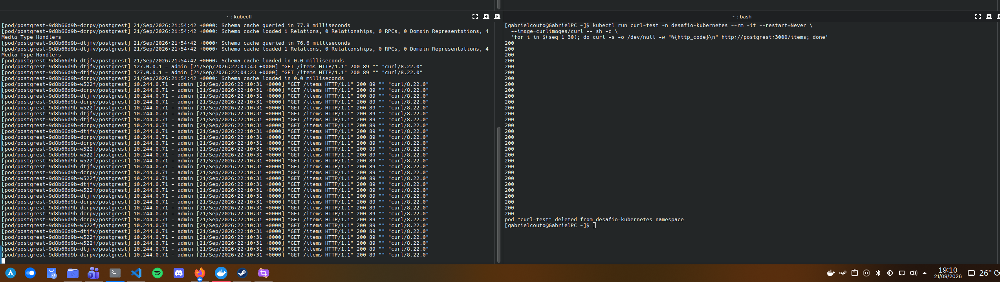
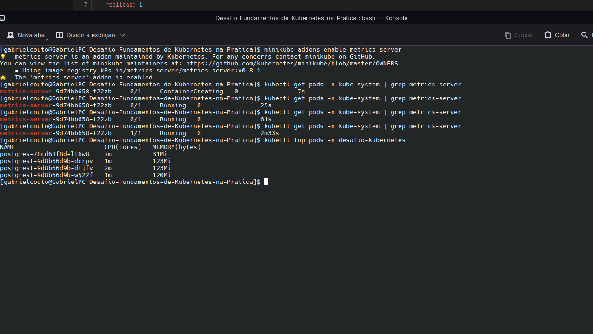
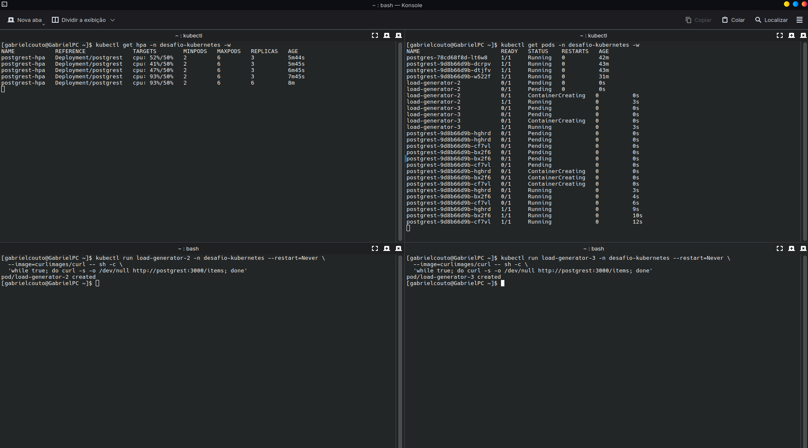
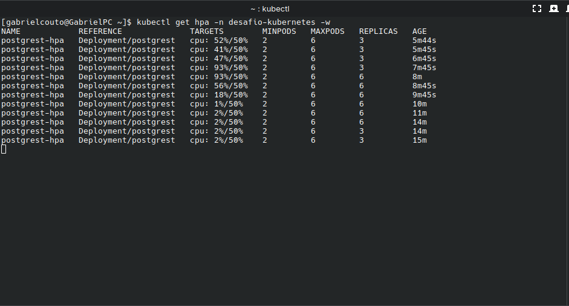

# Desafio: Fundamentos de Kubernetes na Prática

API REST (PostgREST) integrada a um banco PostgreSQL, orquestrada num cluster
Kubernetes local (minikube), com armazenamento persistente, configuração
externalizada via ConfigMap/Secret, descoberta de serviço via DNS interno do
cluster, health checks, e escalonamento automático baseado em CPU — tudo
declarado em manifests YAML versionáveis.

## Sumário

- [Sobre o projeto](#sobre-o-projeto)
- [Arquitetura](#arquitetura)
- [Ferramenta de cluster usada](#ferramenta-de-cluster-usada)
- [Como aplicar os manifests](#como-aplicar-os-manifests)
- [Como testar a API](#como-testar-a-api)
- [O que foi construído, nível por nível](#o-que-foi-construído-nível-por-nível)
- [Decisões técnicas e trade-offs](#decisões-técnicas-e-trade-offs)
- [Estrutura do repositório](#estrutura-do-repositório)
- [Reflexões do desafio](#reflexões-do-desafio)
- [Checklist de requisitos](#checklist-de-requisitos)
- [Limpeza](#limpeza)

## Sobre o projeto

Este repositório implanta, do zero, uma aplicação integrada a um banco de
dados dentro de um cluster Kubernetes local, aplicando os conceitos
fundamentais de orquestração de contêineres: Namespace, Deployment, Service,
ConfigMap, Secret, PersistentVolumeClaim, probes de saúde, requests/limits de
recursos e Horizontal Pod Autoscaler.

A API (**PostgREST**) lê e grava dados num **PostgreSQL**, com os dados
persistidos em disco (sobrevivendo à recriação do Pod do banco), configuração
externalizada, a aplicação acessível de fora do cluster, réplicas
balanceando carga entre si, e escalonamento automático conforme o uso de CPU.

## Arquitetura

```
Você (curl / navegador)
        │  HTTP (port-forward :3000)
        ▼
  Service "postgrest"  (ClusterIP :3000)
        │  balanceia entre N réplicas (2 a 6, via HPA)
        ▼
  Deployment "postgrest"  (postgrest/postgrest:v16.3)
        │  string de conexão via Secret (PGRST_DB_URI)
        │  resolve o host "postgres" via DNS interno do cluster
        │  liveness/readiness via porta admin dedicada (:3001)
        ▼
  Service "postgres"  (ClusterIP :5432)
        │
        ▼
  Deployment "postgres"  (postgres:16.15, strategy: Recreate)
        │  readinessProbe via pg_isready
        │  monta o volume em /var/lib/postgresql/data
        │  tabela "items" criada via init script na 1ª inicialização
        ▼
  PersistentVolumeClaim "postgres-pvc"  (1Gi, ReadWriteOnce)
```

A peça central da integração: a API **nunca** usa o IP do Pod do Postgres —
ela se conecta pelo **nome do Service** (`postgres`), que o DNS interno do
cluster resolve para o Pod correto, mesmo que ele seja recriado e mude de IP.

## Ferramenta de cluster usada

**Minikube**, rodando localmente em Arch Linux, com o driver `docker`. O
addon `metrics-server` foi habilitado para permitir o funcionamento do HPA
(Nível 7):

```bash
minikube start
minikube addons enable metrics-server
kubectl get nodes   # confirma que o nó aparece como "Ready" antes de aplicar qualquer manifest
```

## Como aplicar os manifests

Os arquivos em `manifests/` são numerados na ordem exata em que devem ser
aplicados:

```bash
kubectl apply -f manifests/
```

Para conferir que tudo subiu corretamente:

```bash
kubectl get all -n desafio-kubernetes
kubectl get hpa -n desafio-kubernetes
```

> **Nota sobre reprodutibilidade:** a tabela `items` é criada automaticamente
> pelo script em `03b-postgres-init.yaml`, montado em
> `/docker-entrypoint-initdb.d` — mas esse mecanismo da imagem oficial do
> Postgres só executa scripts de inicialização quando o volume de dados está
> **vazio** (primeira inicialização). Se você reaplicar os manifests sobre um
> PVC que já tem dados, a tabela não será recriada (nem precisa: ela já
> existe).

## Como testar a API

```bash
kubectl port-forward -n desafio-kubernetes svc/postgrest 3000:3000
```

Em outro terminal:

```bash
# Listar itens
curl http://localhost:3000/items

# Inserir um item
curl -X POST http://localhost:3000/items \
  -H "Content-Type: application/json" \
  -d '{"name": "meu primeiro item"}'

# Confirmar que foi salvo
curl http://localhost:3000/items
```

## O que foi construído, nível por nível

### Nível 1 — Namespace e primeiro contato

Criado o namespace `desafio-kubernetes` e, para explorar o comportamento
básico de um Pod, foi criado um Pod avulso de teste com `kubectl run`,
inspecionado com `get`/`describe`/`logs`, e depois deletado.


**O que esse nível provou:** um Pod criado diretamente (sem um controlador
como Deployment) **não volta sozinho** quando deletado. Isso justifica por
que, na prática, Pods quase nunca são criados diretamente — eles são
gerenciados por controladores que garantem um número desejado de réplicas
rodando o tempo todo.

### Nível 2 — Banco de dados com persistência

Implantado o PostgreSQL (`postgres:16.15`) como Deployment, com um
`PersistentVolumeClaim` de 1Gi (`ReadWriteOnce`) montado em
`/var/lib/postgresql/data`. Um Service `ClusterIP` foi criado para que outros
recursos do cluster consigam localizar o banco pelo nome, não por IP.


### Nível 3 — Configuração e segredos

As credenciais do banco foram movidas para um `Secret` (tipo `Opaque`),
injetado via `envFrom`. O nome do banco foi colocado em um `ConfigMap`
separado.


### Nível 4 — A API conectada ao banco (a integração)

Implantado o PostgREST, configurado via `PGRST_DB_URI` — apontando para o
**nome do Service** do Postgres, não para um IP. A tabela `items` foi
confirmada como exposta automaticamente pela API via `GET`/`POST`.


### Nível 5 — Expor a API e provar a persistência

Com a API respondendo via `port-forward`, foi inserido um item de teste e,
em seguida, o **Pod do PostgreSQL foi deletado propositalmente**. O
Deployment recriou o Pod automaticamente, e o dado inserido **antes** da
deleção continuava acessível pela API depois.


### Nível 6 — Health Checks e escala

Adicionadas `livenessProbe` e `readinessProbe` ao PostgREST, apontando para
a **porta administrativa dedicada** (`:3001`, endpoints `/live` e `/ready`)
em vez do endpoint de dados `/items` — evitando gerar carga desnecessária no
banco só para health check. O Postgres recebeu uma `readinessProbe` via
`pg_isready`, a ferramenta nativa que confirma que o banco está de fato
aceitando conexões, não só que a porta está aberta. `requests`/`limits` de
CPU e memória foram definidos para ambos os Deployments. A API foi escalada
para 3 réplicas, e o balanceamento de carga entre elas foi confirmado.




**Evidência do balanceamento:** 30 requisições sequenciais via `curl` foram
distribuídas pelos três Pods diferentes do PostgREST (visível nos logs de
cada Pod), confirmando que o Service `ClusterIP` está roteando o tráfego
entre as réplicas, não sempre para a mesma.

### Nível 7 — Escalonamento automático (bônus)

Habilitado o addon `metrics-server` do minikube (pré-requisito para o HPA
conseguir ler métricas de CPU dos Pods). Criado um
`HorizontalPodAutoscaler` para o Deployment do PostgREST, com `minReplicas: 2`,
`maxReplicas: 6`, escalando quando a utilização média de CPU ultrapassa 50%.
Carga foi gerada com múltiplos Pods rodando `curl` em loop contra a API, e o
HPA foi observado escalando de 3 para 6 réplicas conforme a CPU subia até
93% de utilização, e reduzindo de volta conforme a carga cessava.





## Decisões técnicas e trade-offs

- **`stringData` em vez de `data` no Secret** — evita converter manualmente
  cada valor para Base64.
- **A senha aparece duplicada dentro do Secret** (isolada em
  `POSTGRES_PASSWORD` e embutida em `PGRST_DB_URI`) — limitação prática do
  Kubernetes puro sem ferramentas de templating; não é um problema de
  segurança adicional, só redundância de representação.
- **`PGRST_DB_ANON_ROLE` configurado como o próprio usuário `admin`
  (superusuário)** — simplificação consciente para manter o desafio direto.
  Em produção, o correto seria um *role* com permissões restritas.
- **Sem `storageClassName` explícito no PVC** — o minikube já vem com uma
  `StorageClass` padrão habilitada, provisionando o volume automaticamente.
- **`strategy: type: Recreate` no Deployment do Postgres** — o PVC é
  `ReadWriteOnce` (só pode estar montado por um Pod por vez). Com a
  estratégia padrão (`RollingUpdate`), uma atualização tentaria subir um Pod
  novo antes de derrubar o antigo, e o Pod novo ficaria preso em `Pending`
  esperando um volume já ocupado. `Recreate` derruba o Pod antigo primeiro,
  evitando esse impasse.
- **Tabela `items` criada via ConfigMap de init script** (`03b-postgres-init.yaml`),
  montado em `/docker-entrypoint-initdb.d` — mecanismo oficial da imagem
  `postgres` que executa scripts automaticamente na primeira inicialização
  de um volume vazio, tornando o projeto aplicável com um único comando sem
  passos manuais de `psql`.
- **Deployment do PostgREST sem campo `replicas` fixo** — como o
  `HorizontalPodAutoscaler` (Nível 7) gerencia esse Deployment, deixar um
  valor fixo no YAML criaria conflito entre a reconciliação declarativa do
  `kubectl apply` e as decisões dinâmicas do HPA. Omitir o campo deixa o HPA
  como única fonte de verdade para o número de réplicas.
- **Probes da API na porta administrativa dedicada (`:3001`)**, não no
  endpoint de dados (`/items`) — evita que health checks periódicos gerem
  consultas desnecessárias ao banco.
- **Versões de imagem fixadas com tag exata** (`postgres:16.15`,
  `postgrest/postgrest:v16.3`), em vez de `latest` — garante builds
  reprodutíveis; um `latest` poderia mudar de comportamento entre uma
  aplicação e outra sem aviso.
- **Sem `livenessProbe` no Postgres, apenas `readinessProbe`** — decisão
  consciente, não omissão. Para um banco de dados com réplica única, uma
  liveness mal calibrada é um risco real: se falhar por uma instabilidade
  momentânea (uma query pesada, I/O lento), o Kubernetes mata e reinicia o
  container, podendo interromper uma escrita em andamento e forçar
  recuperação de crash na próxima inicialização. A `readinessProbe` via
  `pg_isready` já cobre o caso que importa aqui — sinalizar quando o banco
  não deve receber tráfego — sem o risco de reinicializações agressivas
  desnecessárias.

## Estrutura do repositório

```
.
├── manifests/
│   ├── 00-namespace.yaml
│   ├── 01-secret.yaml
│   ├── 02-configmap.yaml
│   ├── 03-postgres-pvc.yaml
│   ├── 03b-postgres-init.yaml     # Script de criação da tabela "items"
│   ├── 04-postgres-deployment.yaml
│   ├── 05-postgres-service.yaml
│   ├── 06-postgrest-deployment.yaml
│   ├── 07-postgrest-service.yaml
│   └── 08-postgrest-hpa.yaml
├── docs/
│   └── screenshots/
└── README.md
```

## Reflexões do desafio

**Nível 1 — o Pod avulso volta sozinho ao ser deletado?**
Não. Sem um controlador supervisionando, não existe processo garantindo um
estado desejado — ao deletar, o Pod simplesmente deixa de existir.

**Nível 2 — PVC vs. `emptyDir`, qual a diferença?**
Um `emptyDir` tem seu ciclo de vida atrelado ao **Pod** — se o Pod for
removido, os dados vão junto. Um PVC é independente: o volume por trás dele
sobrevive à destruição e recriação do Pod que o utiliza.

**Nível 3 — o valor do Secret em `-o yaml` é criptografia de verdade?**
Não, é apenas **codificação Base64**, reversível por qualquer pessoa com
acesso ao valor codificado, sem nenhuma chave secreta envolvida.

**Nível 4 — por que usar o nome do Service em vez do IP do Pod?**
Porque o IP de um Pod muda toda vez que ele é recriado. O Service oferece um
nome estável, resolvido via DNS interno, que sempre aponta para o Pod
correto.

**Nível 5 — quantos componentes tiveram que funcionar juntos para o dado sobreviver?**
Cinco: PVC, Deployment do Postgres, Service do Postgres, Secret e a própria
API — todos coordenados pelo Kubernetes sem intervenção manual.

**Nível 6 — qual a diferença prática entre liveness e readiness? Por que escalar a API é seguro, mas escalar o banco com o mesmo PVC não seria?**
`readinessProbe` decide se um Pod deve **receber tráfego** do Service — se
falhar, o Pod é temporariamente removido do balanceamento, mas não é
reiniciado. `livenessProbe` decide se o Pod **precisa ser reiniciado** — se
falhar repetidamente, o Kubernetes mata e recria o container. Um Pod pode
estar "vivo" (liveness ok) mas ainda não pronto para tráfego (readiness
falhando), por exemplo durante um processo de warm-up. Escalar a API é
seguro porque cada réplica do PostgREST é *stateless* — nenhuma delas guarda
dado algum localmente, todas leem/escrevem no mesmo Postgres através do
Service. Escalar o Postgres da mesma forma **não seria seguro** com o
desenho atual: o PVC é `ReadWriteOnce`, então um segundo Pod do banco nem
conseguiria montar o mesmo volume simultaneamente — e mesmo que fosse
tecnicamente possível, múltiplas instâncias de um banco relacional
escrevendo no mesmo arquivo de dados sem coordenação corromperiam o banco.
Escalar um banco de dados de verdade exige replicação nativa (primary/replica),
não apenas aumentar o número de réplicas do Deployment.

**Nível 7 — HPA:**
O HPA depende do `metrics-server` para ler o uso de CPU dos Pods — sem ele,
o comando `kubectl get hpa` mostra `<unknown>` nos targets e nenhum
escalonamento acontece. Sob carga sustentada, o HPA escalou de 3 para 6
réplicas (o `maxReplicas` configurado) conforme a utilização de CPU chegava
a 93%. Ao cessar a carga, o HPA reduziu as réplicas gradualmente de volta —
o Kubernetes aplica um período de estabilização antes de reduzir, para
evitar oscilar (escalar para cima e para baixo repetidamente) em respostas a
picos breves de tráfego.

## Checklist de requisitos

- [x] Namespace próprio criado e todos os recursos isolados nele
- [x] PostgreSQL rodando com PersistentVolumeClaim
- [x] Credenciais do banco em Secret (não hardcoded no YAML)
- [x] Configuração não sensível em ConfigMap
- [x] API (PostgREST) conectada ao banco pelo nome do Service
- [x] API acessível de fora do cluster e servindo dados do banco
- [x] Dado inserido pela API sobrevive à deleção do Pod do banco (persistência comprovada)
- [x] Liveness e Readiness probes configuradas na API
- [x] Requests e Limits de recursos definidos
- [x] Manifests versionados em arquivos YAML organizados
- [x] README documentando como aplicar e testar o projeto
- [x] **Bônus:** Horizontal Pod Autoscaler configurado e testado com geração de carga real

## Limpeza

Para remover todos os recursos do desafio de uma vez, exclua o namespace
completo:

```bash
kubectl delete namespace desafio-kubernetes
```

### Atenção

**Esse comando remove todos os recursos do desafio, incluindo o PostgreSQL e
os dados armazenados no PVC.**