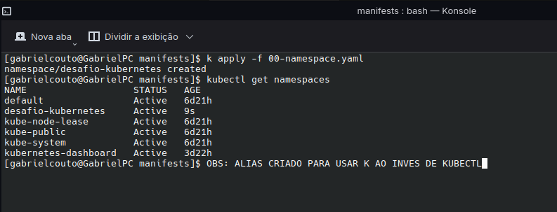
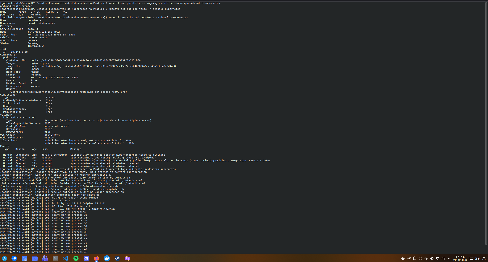
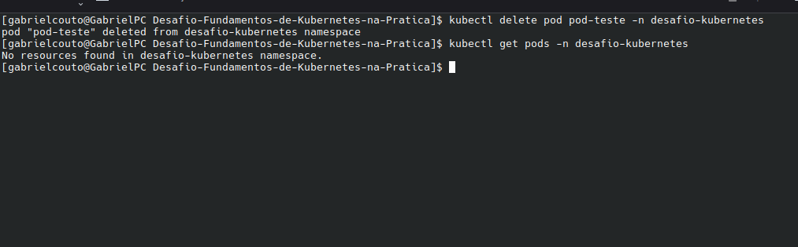
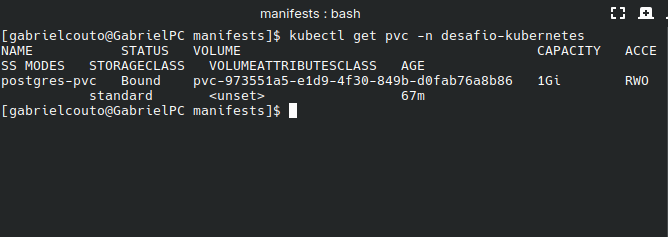
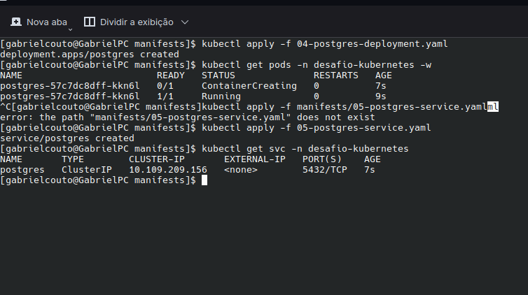
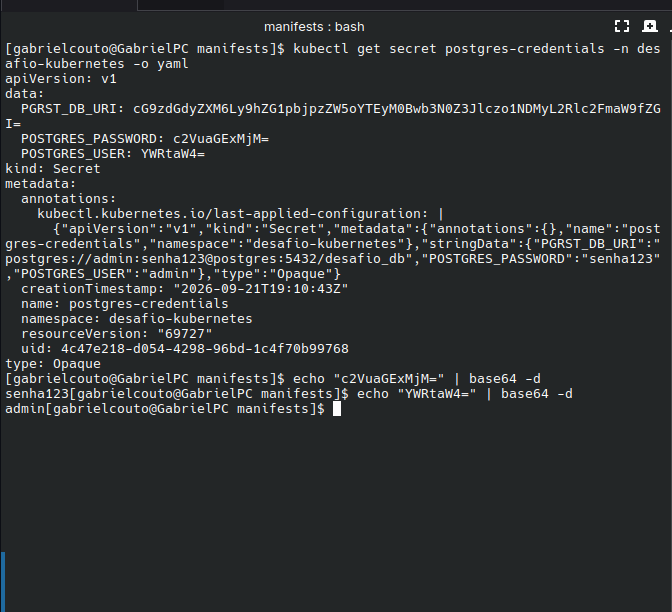
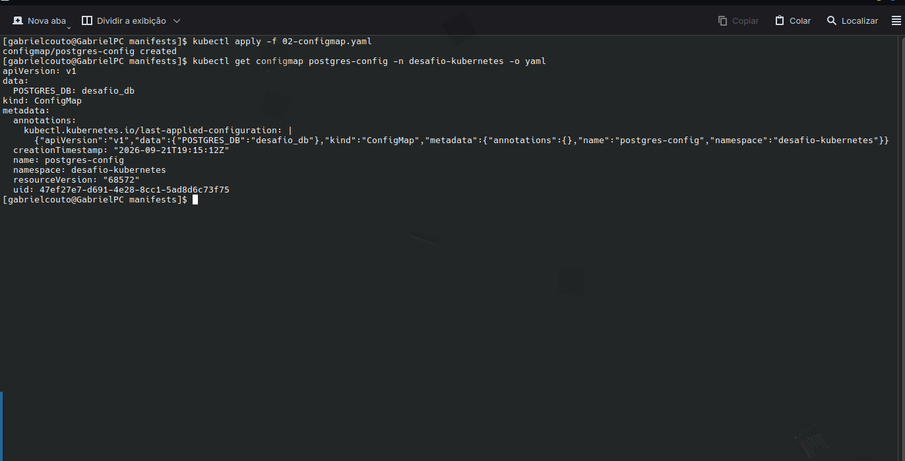
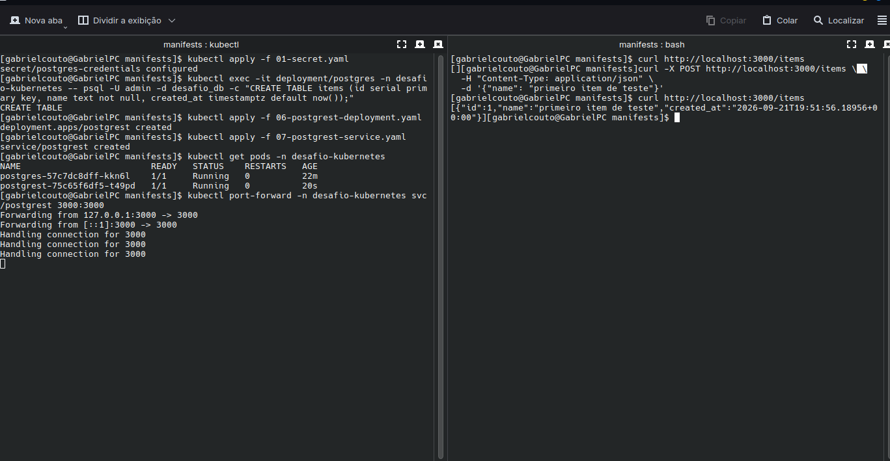
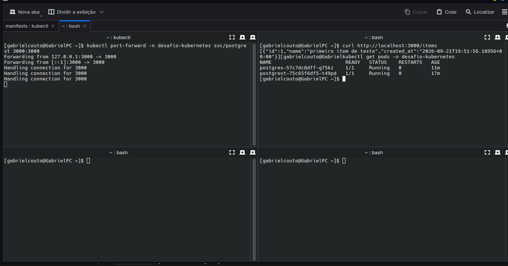
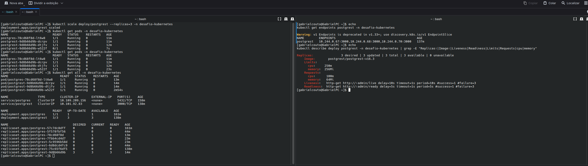

# Desafio: Fundamentos de Kubernetes na Prática

API REST (PostgREST) integrada a um banco PostgreSQL, orquestrada num cluster
Kubernetes local (minikube), com armazenamento persistente, configuração
externalizada via ConfigMap/Secret, descoberta de serviço via DNS interno do
cluster, health checks, escalonamento manual e automático (HPA) — tudo
declarado em manifests YAML versionáveis.

> **Status deste README:** documenta todos os níveis do desafio, do 1 ao 7
> (incluindo o bônus de Horizontal Pod Autoscaler).

## Sumário

- [Sobre o projeto](#sobre-o-projeto)
- [Arquitetura](#arquitetura)
- [Ferramenta de cluster usada](#ferramenta-de-cluster-usada)
- [Como aplicar os manifests](#como-aplicar-os-manifests)
- [Como testar a API](#como-testar-a-api)
- [O que foi construído, nível por nível](#o-que-foi-construído-nível-por-nível)
- [Decisões técnicas e trade-offs](#decisões-técnicas-e-trade-offs)
- [Estrutura do repositório](#estrutura-do-repositório)
- [Reflexões do desafio](#reflexões-do-desafio)
- [Checklist de requisitos](#checklist-de-requisitos)
- [Limpeza](#limpeza)

## Sobre o projeto

Este repositório implanta, do zero, uma aplicação integrada a um banco de
dados dentro de um cluster Kubernetes local, aplicando os conceitos
fundamentais de orquestração de contêineres: Namespace, Deployment, Service,
ConfigMap, Secret, PersistentVolumeClaim, probes de saúde, requests/limits de
recursos e escalonamento (manual e automático via HPA).

A API (**PostgREST**) lê e grava dados num **PostgreSQL**, com os dados
persistidos em disco (sobrevivendo à recriação do Pod do banco), configuração
externalizada, health checks garantindo que só recebe tráfego quando está de
fato pronta, e a aplicação acessível de fora do cluster via
`kubectl port-forward`.

## Arquitetura

```
Você (curl / navegador)
        │  HTTP (port-forward :3000)
        ▼
  Service "postgrest"  (ClusterIP :3000)
        │
        ▼
  Deployment "postgrest"  (imagem postgrest/postgrest:v16.3)
        │  2 a 6 réplicas (escalonamento manual + HPA por CPU)
        │  string de conexão via Secret (PGRST_DB_URI)
        │  resolve o host "postgres" via DNS interno do cluster
        │  liveness/readiness via admin server (/live, /ready)
        ▼
  Service "postgres"  (ClusterIP :5432)
        │
        ▼
  Deployment "postgres"  (imagem postgres:16.15)
        │  readiness via pg_isready
        │  monta o volume em /var/lib/postgresql/data
        ▼
  PersistentVolumeClaim "postgres-pvc"  (1Gi, ReadWriteOnce)
```

A peça central da integração: a API **nunca** usa o IP do Pod do Postgres —
ela se conecta pelo **nome do Service** (`postgres`), que o DNS interno do
cluster resolve para o Pod correto, mesmo que ele seja recriado e mude de IP.

## Ferramenta de cluster usada

**Minikube**, rodando localmente em Arch Linux, com o driver `docker`.

```bash
minikube start
kubectl get nodes   # confirma que o nó aparece como "Ready" antes de aplicar qualquer manifest
```

Para o Nível 7 (HPA), o addon `metrics-server` do minikube também precisa
estar habilitado:

```bash
minikube addons enable metrics-server
kubectl top pods -n desafio-kubernetes   # confirma que as métricas já estão disponíveis
```

## Como aplicar os manifests

Os arquivos em `manifests/` são numerados na ordem exata em que devem ser
aplicados (o Namespace precisa existir antes de qualquer recurso que dependa
dele, o Secret antes do Deployment que o consome, e assim por diante):

```bash
kubectl apply -f manifests/
```

Isso aplica todos os arquivos da pasta de uma vez, na ordem alfabética dos
nomes — por isso a numeração (`00-`, `01-`, `02-`...) importa.

Para conferir que tudo subiu corretamente:

```bash
kubectl get all -n desafio-kubernetes
```

> **Nota:** a tabela `items` usada nos testes abaixo não é criada
> automaticamente pelos manifests — veja
> [Decisões técnicas e trade-offs](#decisões-técnicas-e-trade-offs) para o
> comando exato de criação num cluster novo.

## Como testar a API

Com os Pods rodando, abra um túnel local até o Service da API:

```bash
kubectl port-forward -n desafio-kubernetes svc/postgrest 3000:3000
```

Em outro terminal:

```bash
# Listar itens
curl http://localhost:3000/items

# Inserir um item
curl -X POST http://localhost:3000/items \
  -H "Content-Type: application/json" \
  -d '{"name": "meu primeiro item"}'

# Confirmar que foi salvo
curl http://localhost:3000/items
```

## O que foi construído, nível por nível

### Nível 1 — Namespace e primeiro contato

Criado o namespace `desafio-kubernetes` (todos os recursos do projeto vivem
isolados nele) e, para explorar o comportamento básico de um Pod, foi criado
um Pod avulso de teste com `kubectl run`, inspecionado com `get`/`describe`/
`logs`, e depois deletado.





**O que esse nível provou:** um Pod criado diretamente (sem um controlador
como Deployment) **não volta sozinho** quando deletado — depois do
`kubectl delete`, `kubectl get pods` retornou vazio. Não existe nenhum
processo de reconciliação cuidando dele. Isso justifica por que, na prática,
Pods quase nunca são criados diretamente — eles são gerenciados por
controladores (Deployments, no caso deste projeto) que garantem um número
desejado de réplicas rodando o tempo todo.

### Nível 2 — Banco de dados com persistência

Implantado o PostgreSQL (`postgres:16`) como Deployment, com um
`PersistentVolumeClaim` de 1Gi (`ReadWriteOnce`) montado em
`/var/lib/postgresql/data` — o caminho onde a imagem oficial grava seus
arquivos de dados. Um Service `ClusterIP` foi criado para que outros recursos
do cluster consigam localizar o banco pelo nome, não por IP.





### Nível 3 — Configuração e segredos

As credenciais do banco (`POSTGRES_USER`, `POSTGRES_PASSWORD`) foram movidas
para um `Secret` (tipo `Opaque`), injetado no container via `envFrom`. O nome
do banco (`POSTGRES_DB`), que não é uma informação sensível, foi colocado em
um `ConfigMap` separado.




### Nível 4 — A API conectada ao banco (a integração)

Implantado o PostgREST como Deployment, configurado via variável de ambiente
`PGRST_DB_URI` — uma string de conexão que aponta para o **nome do Service**
do Postgres (`postgres`), não para um IP. Essa chave foi adicionada ao mesmo
Secret do Nível 3, reaproveitando usuário e senha já existentes. Uma tabela
`items` foi criada no banco, e confirmada como exposta automaticamente pela
API via `GET`/`POST`.



### Nível 5 — Expor a API e provar a persistência

Com a API já respondendo via `port-forward`, foi inserido um item de teste
e, em seguida, o **Pod do PostgreSQL foi deletado propositalmente**. O
Deployment recriou o Pod automaticamente (com um nome novo, confirmando que
era um Pod diferente do original). A API foi consultada novamente, e o item
inserido **antes** da deleção continuava lá.



**Isso comprova que os dados nunca estiveram "dentro" do Pod** — eles sempre
estiveram no volume persistente (PVC), que sobrevive independentemente de
qual Pod específico está montando ele no momento.

### Nível 6 — Health Checks e escala

Adicionadas `readinessProbe` e `livenessProbe` ao PostgREST, usando o
**admin server** nativo dele (habilitado com `PGRST_ADMIN_SERVER_PORT=3001`),
que expõe os endpoints `/live` e `/ready` numa porta separada da API
principal — o `/ready` verifica o pool de conexões e o schema cache antes de
responder `200`, o que o torna ideal como readiness. Ao PostgreSQL foi
adicionada uma `readinessProbe` via `pg_isready`, e seu Deployment passou a
usar `strategy: Recreate` (necessário porque o PVC é `ReadWriteOnce` — um
rolling update deixaria dois Pods disputando o mesmo volume). Ambos os
Deployments passaram a declarar `requests` e `limits` de CPU e memória.

A API foi então escalada manualmente para 3 réplicas, e o balanceamento de
carga do Service foi comprovado na prática: disparando 30 requisições de
dentro do cluster (via um Pod `curl` temporário) e acompanhando
`kubectl logs -l app=postgrest --prefix -f` em tempo real, as requisições
apareceram distribuídas entre os três Pods.




**O que esse nível provou:** com `kubectl get endpoints postgrest`, o
Service já listava os 3 IPs das réplicas. As 30 requisições do teste de
carga retornaram `200` e ficaram espalhadas entre os três Pods nos logs —
sem nenhuma configuração extra além de apontar todos para o mesmo Service,
confirmando que o balanceamento é nativo do Kubernetes.

### Nível 7 — Escalonamento automático (bônus)

Habilitado o addon `metrics-server` do minikube, pré-requisito do
Horizontal Pod Autoscaler para conseguir ler o uso de CPU dos Pods.


Criado um `HorizontalPodAutoscaler` (`postgrest-hpa`) apontando para o
Deployment `postgrest`, com `minReplicas: 2`, `maxReplicas: 6` e alvo de 50%
de utilização média de CPU (calculado sobre o `requests.cpu` de `100m`
definido no Nível 6). Para gerar carga real, três Pods `curl` temporários
foram colocados em loop apertado contra o Service `postgrest` em paralelo.


O uso de CPU subiu a até 93% do alvo, e o HPA escalou automaticamente as
réplicas de 3 para 6 (o `maxReplicas` configurado) em questão de minutos,
sem nenhuma intervenção manual. Depois de remover a carga, o `TARGETS`
voltou para valores baixos (1-2%), e o HPA reduziu as réplicas de volta ao
mínimo assim que o período de estabilização padrão (5 minutos desde a última
escalada para cima) expirou:


**O que esse nível provou:** dois comportamentos do HPA ficaram visíveis na
prática. Primeiro, a **zona de tolerância** de ±10% ao redor do alvo: com o
`TARGETS` oscilando em 52-56% (o alvo é 50%), o HPA não escalou de imediato,
porque esses valores ainda caem dentro da margem de tolerância padrão — só
quando a carga triplicou (93%) é que a escalada aconteceu de fato. Segundo,
a **janela de estabilização de scale-down**: mesmo com o uso de CPU já baixo
há minutos, o número de réplicas só caiu depois de passado o tempo mínimo
desde a última escalada para cima, evitando o efeito sanfona (subir e descer
réplicas repetidamente por picos curtos de tráfego).

## Decisões técnicas e trade-offs

- **`stringData` em vez de `data` no Secret** — evita ter que converter
  manualmente cada valor para Base64; o Kubernetes faz essa codificação
  automaticamente ao aplicar.
- **A senha aparece duplicada dentro do Secret** (uma vez isolada em
  `POSTGRES_PASSWORD`, outra vez embutida em `PGRST_DB_URI`) — é uma
  limitação prática do Kubernetes puro, sem ferramentas de templating como
  Helm. Não é um problema de segurança adicional (o Secret já protege ambos
  os valores da mesma forma), só uma redundância de representação. Uma
  alternativa sem duplicar o valor seria compor a URI a partir das outras
  chaves do próprio Secret, usando a expansão de variáveis do Kubernetes
  (`$(POSTGRES_USER)`, `$(POSTGRES_PASSWORD)`) na definição do `env` do
  Deployment do PostgREST.
- **`PGRST_DB_ANON_ROLE` configurado como o próprio usuário `admin`
  (superusuário)** — simplificação consciente para manter o desafio direto.
  Em produção, o correto seria criar um *role* específico no PostgreSQL com
  permissões restritas apenas às tabelas que a API deve expor.
- **A tabela `items` não é criada automaticamente pelos manifests** — ela foi
  criada manualmente durante o desenvolvimento com
  `kubectl exec -it deployment/postgres -- psql -U admin -d desafio_db -c "CREATE TABLE items (id serial primary key, name text not null, created_at timestamptz default now());"`.
  Num cluster novo (PVC recriado do zero), é preciso repetir esse comando
  antes de a API conseguir servir `/items`. Uma evolução natural seria mover
  essa criação para um script `init.sql` num ConfigMap, montado em
  `/docker-entrypoint-initdb.d` no container do Postgres, que roda
  automaticamente na primeira inicialização do volume.
- **Sem `storageClassName` explícito no PVC** — o minikube já vem com uma
  `StorageClass` padrão habilitada (`default-storageclass`), então omitir o
  campo deixa o Kubernetes provisionar o volume automaticamente.
- **`strategy: Recreate` no Deployment do Postgres** — como o PVC é
  `ReadWriteOnce`, uma estratégia `RollingUpdate` (o padrão) poderia tentar
  subir um segundo Pod antes de derrubar o primeiro, e os dois disputariam o
  mesmo volume. `Recreate` garante que o Pod antigo é sempre removido antes
  de o novo ser criado.
- **Health check do PostgREST via admin server, não via porta principal** —
  o PostgREST expõe `/live` e `/ready` numa porta administrativa separada
  (`PGRST_ADMIN_SERVER_PORT`), habilitada à parte da porta 3000 usada pela
  API. Isso evita que verificações de saúde concorram com o tráfego real de
  requisições.
- **Alvo de 50% de CPU no HPA** — valor didático para conseguir provocar uma
  escalada visível gerando carga localmente com poucos Pods `curl`. Em um
  cenário real, esse número seria calibrado observando o comportamento da
  aplicação sob carga de produção.
- **Sem `replicas:` no Deployment do PostgREST** — o campo foi removido de
  propósito depois de o HPA entrar em cena. Se o Deployment declarasse um
  número fixo (ex: `replicas: 2`) e o HPA também controlasse esse mesmo
  campo, todo `kubectl apply` reaplicaria o valor do YAML por cima do que o
  HPA tivesse decidido em runtime, criando um conflito entre as duas fontes
  de verdade. Sem o campo, o Kubernetes usa 1 réplica apenas na primeira
  criação do recurso, e a partir daí o `HorizontalPodAutoscaler`
  (`manifests/08-postgrest-hpa.yaml`) passa a ser o único responsável por
  esse número, entre 2 (`minReplicas`) e 6 (`maxReplicas`).

## Estrutura do repositório

```
.
├── manifests/
│   ├── 00-namespace.yaml          # Namespace isolando todos os recursos
│   ├── 01-secret.yaml             # Credenciais do Postgres + string de conexão da API
│   ├── 02-configmap.yaml          # Nome do banco (config não sensível)
│   ├── 03-postgres-pvc.yaml       # Armazenamento persistente (1Gi)
│   ├── 04-postgres-deployment.yaml    # Postgres: Recreate, readinessProbe, resources
│   ├── 05-postgres-service.yaml
│   ├── 06-postgrest-deployment.yaml   # API: probes via admin server, resources
│   ├── 07-postgrest-service.yaml
│   └── 08-postgrest-hpa.yaml          # HPA: 2-6 réplicas, alvo de 50% CPU
├── docs/
│   └── screenshots/                # Evidências de cada nível, numeradas
└── README.md
```

## Reflexões do desafio

**Nível 1 — o Pod avulso volta sozinho ao ser deletado?**
Não. Sem um controlador (Deployment, StatefulSet, etc.) supervisionando,
não existe nenhum processo garantindo um estado desejado ao deletar, o
Pod simplesmente deixa de existir. É por isso que, na prática, Pods quase
nunca são criados diretamente.

**Nível 2 — PVC vs. `emptyDir`, qual a diferença?**
Um `emptyDir` também é um volume, mas seu ciclo de vida está atrelado ao
**Pod**, não ao cluster, se o Pod for removido, os dados do `emptyDir` vão
junto. Um PVC é um recurso independente: mesmo que o Pod que o utiliza seja
destruído e recriado, o volume por trás do PVC continua existindo, e o novo
Pod pode montar o mesmo volume, com os mesmos dados.

**Nível 3 — o valor do Secret em `-o yaml` é criptografia de verdade?**
Não, é apenas **codificação Base64**, reversível por qualquer pessoa que
tenha acesso ao valor codificado (`echo "valor" | base64 -d` decodifica
instantaneamente, sem nenhuma chave secreta envolvida). Um Secret do
Kubernetes evita que a credencial fique visível "a olho nu" dentro do YAML
do Deployment, mas não é, por si só, uma proteção equivalente a criptografia
real contra alguém com acesso de leitura ao cluster.

**Nível 4 — por que usar o nome do Service em vez do IP do Pod?**
Porque o IP de um Pod muda toda vez que ele é recriado. Se a string de
conexão da API apontasse para um IP fixo, bastaria o Pod do banco reiniciar
uma única vez para a conexão quebrar permanentemente. O Service oferece um
nome estável, resolvido via DNS interno do cluster, que sempre aponta para o
Pod correto independente de quantas vezes ele seja recriado ou qual IP
tenha no momento.

**Nível 5 — quantos componentes tiveram que funcionar juntos para o dado sobreviver?**
Cinco: o **PVC** (guardando os dados fisicamente), o **Deployment do
Postgres** (recriando o Pod automaticamente), o **Service do Postgres**
(mantendo a API capaz de encontrá-lo mesmo após a recriação), o **Secret**
(fornecendo as credenciais corretas ao novo Pod) e a **API** (consultando o
banco de novo, sem nenhuma reconfiguração manual). Isso mostra como o
Kubernetes coordena múltiplas peças independentes para entregar resiliência
sem intervenção humana.

**Nível 6 — qual a diferença prática entre liveness e readiness?**
A liveness probe decide quando o Kubernetes deve **reiniciar** o container —
ela falhar indica que o processo travou e não vai se recuperar sozinho. A
readiness probe decide quando o Pod deve **receber tráfego** — falhar nela
apenas remove o Pod do Service (dos endpoints), sem reiniciá-lo, o que é
útil quando o problema é temporário (como o banco estar indisponível por um
instante).

**Nível 6 — por que escalar a API é seguro, mas escalar o banco desse jeito não seria?**
A API (PostgREST) é **stateless**: cada réplica não guarda nada em memória
entre requisições, então qualquer uma delas pode atender qualquer chamada
igualmente. O PostgreSQL, por outro lado, guarda seus dados em um único PVC
`ReadWriteOnce`, montado por um único Pod. Subir mais réplicas do Deployment
do banco faria com que vários processos Postgres tentassem escrever no mesmo
diretório de dados ao mesmo tempo, corrompendo os arquivos — além de o
`ReadWriteOnce` sequer permitir que o volume seja montado por mais de um nó
simultaneamente. Replicar um banco de verdade exige uma arquitetura própria
(StatefulSet, réplicas de leitura, um operator como o Patroni), não apenas
aumentar `replicas:`.

**Nível 7 — o que se observou ao configurar o HPA e gerar carga?**
Duas coisas que não ficam óbvias só lendo a documentação. A primeira é que o
HPA não reage a qualquer variação acima do alvo — ele tem uma zona de
tolerância (±10% por padrão), então uma utilização de 52-56% contra um alvo
de 50% não foi suficiente para disparar uma escalada; só quando a carga
triplicou (93%) é que réplicas novas foram criadas. A segunda é que reduzir
réplicas é deliberadamente mais lento que aumentar: mesmo com o uso de CPU
já baixo, o HPA esperou o fim de uma janela de estabilização (5 minutos
desde a última vez que escalou para cima) antes de reduzir o número de
Pods — um mecanismo para evitar que picos curtos de tráfego causem
escaladas e reduções repetidas (efeito sanfona).

## Checklist de requisitos

- [x] Namespace próprio criado e todos os recursos isolados nele
- [x] PostgreSQL rodando com PersistentVolumeClaim
- [x] Credenciais do banco em Secret (não hardcoded no YAML)
- [x] Configuração não sensível em ConfigMap
- [x] API (PostgREST) conectada ao banco pelo nome do Service
- [x] API acessível de fora do cluster e servindo dados do banco
- [x] Dado inserido pela API sobrevive à deleção do Pod do banco (persistência comprovada)
- [x] Liveness e Readiness probes configuradas na API
- [x] Requests e Limits de recursos definidos
- [x] Manifests versionados em arquivos YAML organizados
- [x] README documentando como aplicar e testar o projeto
- [x] *(Bônus)* Horizontal Pod Autoscaler configurado e testado sob carga

## Limpeza

Para remover todos os recursos do desafio de uma vez:

```bash
kubectl delete namespace desafio-kubernetes
```

Isso apaga o Namespace e tudo que está dentro dele (Deployments, Services,
Pods, Secret, ConfigMap, PVC, HPA) em um único comando.